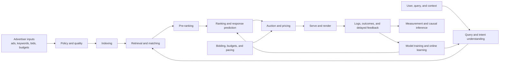

# Ads Literature Hub

A component-oriented map of papers, courses, datasets, and references for building advertising systems. It is written for engineers coming from Search, ranking, recommendations, or machine learning.

## The ads-serving system

Safety, privacy, fairness, fraud prevention, experimentation, observability, and marketplace health cut across every stage.

## Collections

| Component | Core question | Collection |
|---|---|---|
| Foundations | How does the whole ads marketplace fit together? | [Foundations and surveys](papers/00-foundations-and-surveys.md) |
| Query and ad understanding | What do the user and advertiser mean? | [Query and ad understanding](papers/01-query-and-ad-understanding.md) |
| Indexing and retrieval | Which ads are eligible candidates? | [Indexing and retrieval](papers/02-indexing-and-retrieval.md) |
| Ranking and prediction | What is likely to be clicked, converted, or valued? | [Ranking and response prediction](papers/03-ranking-and-response-prediction.md) |
| Auctions | Who wins, where are they placed, and what do they pay? | [Auctions and mechanism design](papers/04-auctions-and-mechanism-design.md) |
| Delivery | How should bids, budgets, and traffic be controlled over time? | [Bidding, budgeting, and pacing](papers/05-bidding-budgeting-and-pacing.md) |
| Measurement | Did advertising cause an incremental outcome? | [Experimentation, measurement, and causality](papers/06-experimentation-measurement-and-causality.md) |
| Exploration | How does the system learn while serving traffic? | [Bandits and online learning](papers/07-bandits-and-online-learning.md) |
| Trust | How do we protect users and marketplace integrity? | [Quality, safety, privacy, fairness, and fraud](papers/08-quality-safety-privacy-fairness-and-fraud.md) |

Additional resources:

- [Courses and learning resources](resources/courses.md)
- [Datasets and benchmarks](resources/datasets-and-benchmarks.md)
- [Metrics and equations](resources/metrics-and-equations.md)

## How entries are curated

The collection favors original papers, publisher pages, and official documentation. Each entry should state the venue/year and explain why it matters. “Seminal” marks historically influential work; “production” marks unusually useful implementation lessons; “recent” marks promising work that has not yet stood the test of time.

See [CONTRIBUTING.md](CONTRIBUTING.md) before adding a resource.
